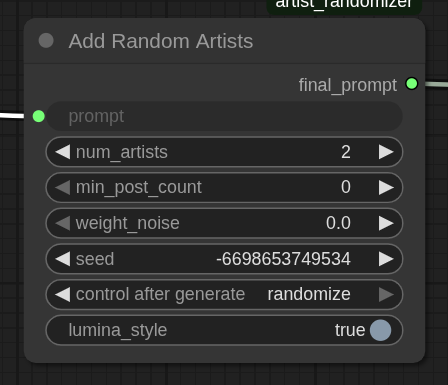

---

# Artist tag randomizer for comfyui

A node for including random artists usernames to a prompt. 

---

## Nodes Included

### 1. **Text Input**


A primitive **multi-line text input** node.

ComfyUI doesn't include a built-in multiline text node, only one-line string primitive that is ugly, so here it is

You can use whatever else text input node if you wish so, the one from comfyroll pack, for example.

---

### 2. **Add Random Artists**




This node appends to prompt randomly selected artist usernames that were harvested from danbooru.
A few parameters are available:

#### 🔧 Parameters

| Name             | Type      | Description                                                                   |
|------------------|-----------|-------------------------------------------------------------------------------|
| `prompt`         | `STRING`  | Your base prompt text to add generated artist tags                            |
| `num_artists`    | `INT`     | Number of artists to include in the prompt                                    |
| `min_post_count` | `INT`     | Only include artists with at least this many posts                            |
| `weight_noise`   | `FLOAT`   | If > 0, randomly applies weights to some artist tags in the range `1 ± noise` |
| `seed`           | `INT`     | Seed value for reproducible randomization                                     |
| `lumina_style`   | `BOOLEAN` | Add lumina-esque tags, e.g. @username1, @username2                            |

Use the `__random_artists__` placeholder in the original prompt,
it will be replaced by the generated tags. If the placeholder is not found, the tags will be appended to the prompt.

#### Output

A `STRING` that contains the prompt and random artist usernames

I recommend getting a node for text output to see what the result prompt turned out to be, this one for example -> https://github.com/fairy-root/ComfyUI-Show-Text 

---

## Installation

1. Clone this repository into your ComfyUI/custom_nodes:

```bash
git clone https://github.com/lonelyowl13/artist_randomizer.git
```

2. Restart comfy.
